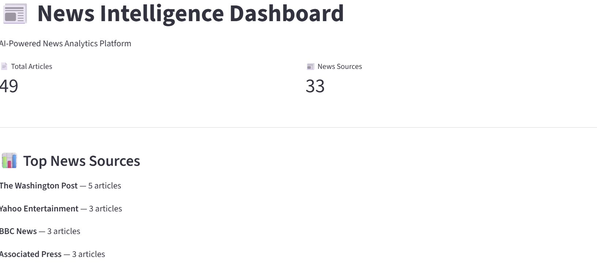
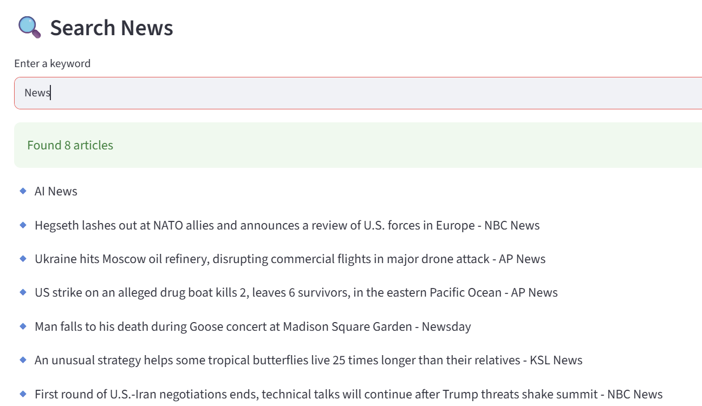
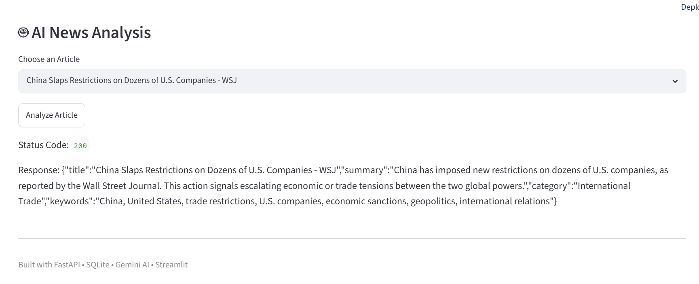
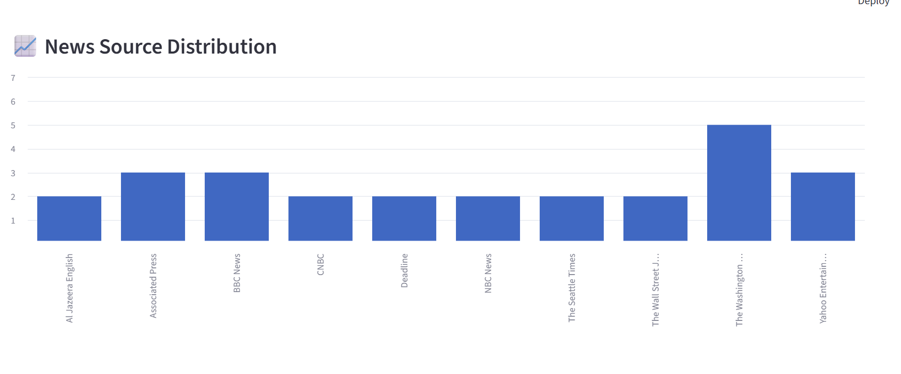

# 📰 News Intelligence Platform

An AI-powered news analytics platform built using FastAPI, SQLite, Gemini AI, and Streamlit.

## Features

* Search News Articles
* Latest News Feed
* News Source Analytics
* AI-Powered Article Analysis
* Source Distribution Charts
* Interactive Dashboard

## Tech Stack

* Python
* FastAPI
* SQLite
* Streamlit
* Pandas
* Gemini AI
* NewsAPI

## Dashboard

## Search Feature

## AI Analysis

## Analytics Chart

## What I Learned

* REST API Development
* Database Design
* AI Integration
* Dashboard Development
* Data Visualization
* Prompt Engineering
* API Testing
